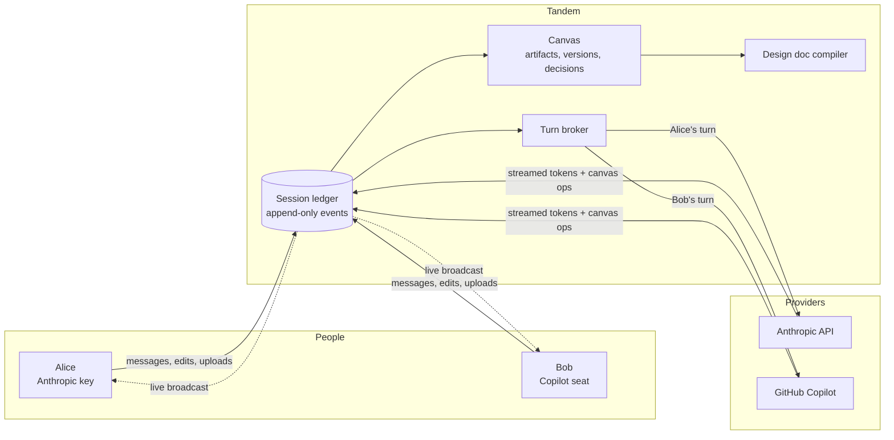
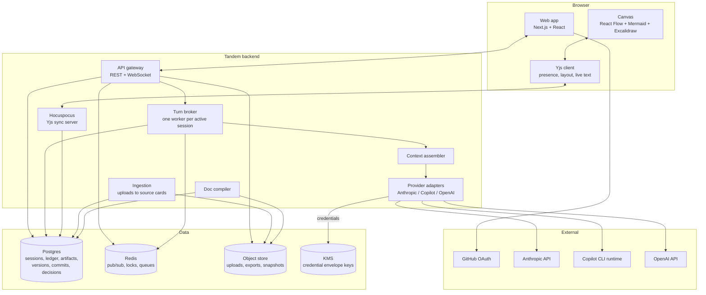
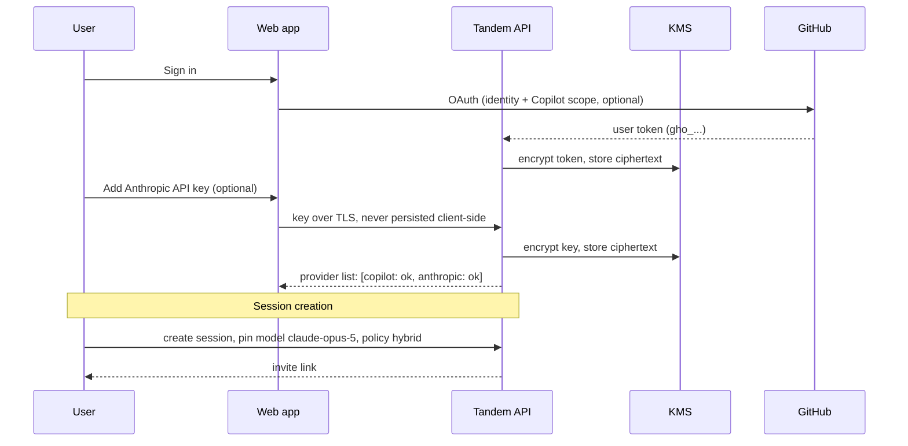
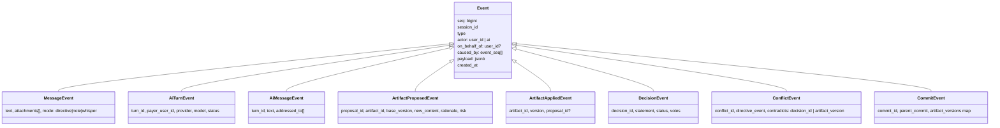
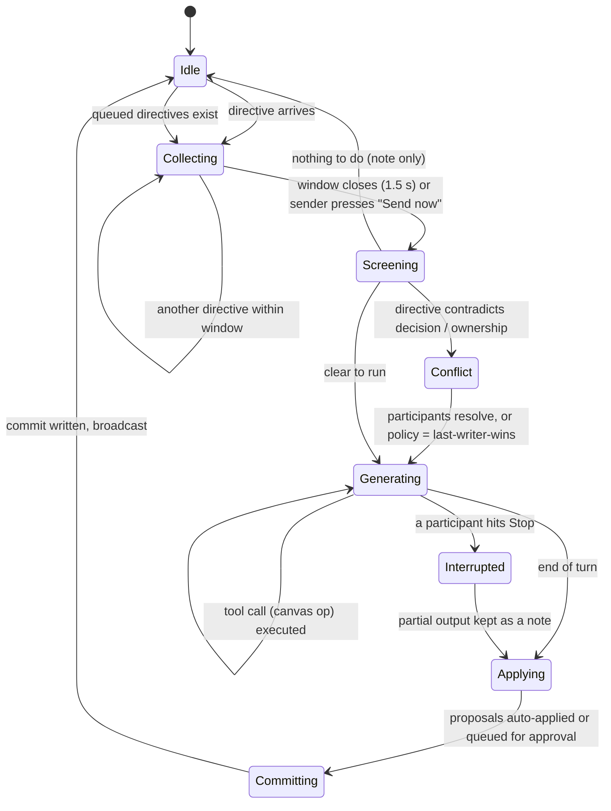
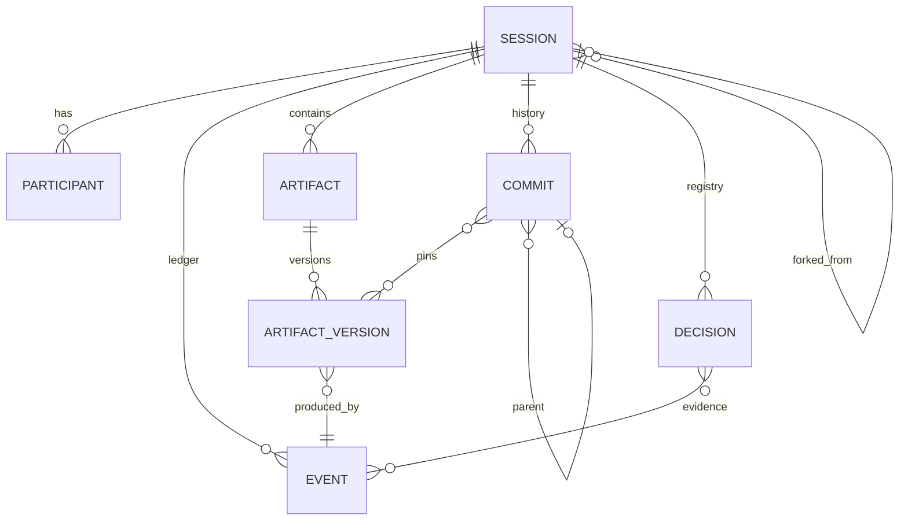
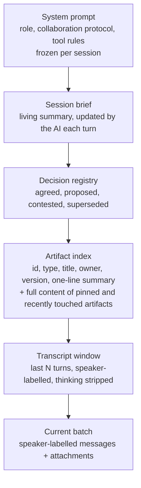
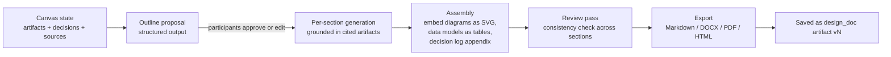

# Tandem: Architecture Document

*Shared AI sessions for software architects. Working name: Tandem.*
*Companion documents: `01-research-findings.md` (what exists, what is possible) and `03-technical-design-spec.md` (build-level detail for Claude).*

---

## 1. The concept in one page

Two or more software architects open a shared session in a web app. Each signs in with their own identity (GitHub) and attaches their own AI credentials: an Anthropic API key, a GitHub Copilot subscription, or an OpenAI key. The session has one AI participant and one shared context. Anyone can address the AI; the turn runs on the credentials of the person who asked, but the result lands in the context everyone shares.

To the right of the conversation is a canvas. The AI populates it with artifacts: Mermaid architecture diagrams, ER diagrams, sequence diagrams, Markdown notes, data models, decision records, source cards for uploaded documents. Humans can edit artifacts directly, comment on them, and upload their own. When Alice says "Service A publishes Kafka events" and Bob says "Service B consumes them and writes to Postgres", the AI updates one diagram, records two decisions, and attributes each to its author.

Steering is governed, not free-for-all. Turns are serialized. Near-simultaneous messages merge into one labelled prompt. When a directive contradicts a recorded decision or rewrites something the other person authored, the AI raises a Decision Point instead of silently choosing. Every applied change is versioned; every AI turn is a commit; anything can be rolled back or forked into a v2.

When the canvas says what everyone wants it to say, one command compiles it into a complete design document with sections, diagrams, data models and the decision log, exportable as Markdown, DOCX or PDF. The session, its artifacts and its full history persist for later tuning.



---

## 2. Design principles

1. **The session is the source of truth, not the model.** The AI holds no state between turns. Everything it knows is rebuilt from the ledger each turn. This is what makes credential rotation, replay, rollback and forks possible.
2. **One AI turn at a time.** Serialized inference with a live broadcast gives every participant the same view. Parallel inference over a shared context produces contradictions nobody can reconcile.
3. **Nothing is anonymous.** Every message, edit, tool call and generated block carries who caused it. The AI is never the author of record; it acts on behalf of a named person in response to a named message.
4. **The AI escalates disagreement, it does not adjudicate it.** Contradictions become explicit Decision Points that people resolve.
5. **Governance is a dial.** Speed for whiteboarding, rigor for design review. The same mechanism (proposals) serves both; only the auto-apply rules change.
6. **Everything is a version; nothing is deleted.** Artifacts have immutable versions, sessions have commits, rollback is a forward commit.
7. **Bring your own credentials, keep your own bill.** Tandem never resells inference. Each participant pays their provider directly.

---

## 3. System context and containers



### Container responsibilities

| Container | Responsibility | Key decisions |
|---|---|---|
| Web app | Conversation pane, canvas, side channel, approvals UI, timeline | Next.js, React 19. Canvas cards are React Flow nodes. |
| API gateway | Auth, session CRUD, ledger append, event fan-out over WebSocket | Fastify. Every mutation becomes a ledger event before anything else happens. |
| Turn broker | Owns the AI turn lifecycle for a session: collect, generate, apply, commit | One BullMQ worker holds a Redis lock per session. Serialization is enforced here, not in the UI. |
| Context assembler | Renders the ledger into a provider-neutral prompt: system, brief, decisions, artifact index, transcript window | Stable prefix first so prompt caching works. Attribution-preserving compaction. |
| Provider adapters | Translate the neutral prompt and tool calls into Anthropic, Copilot or OpenAI calls under a specific user's credentials; stream back | Adapter interface fixed; Anthropic adapter is reference. |
| Hocuspocus | CRDT sync for canvas layout, cursors, presence, and live text edits inside artifacts | Yjs docs persisted to Postgres. |
| Doc compiler | Multi-step pipeline from canvas state to design document | Structured outputs for outline, per-section generation grounded in artifacts. |
| Ingestion | Uploads to source cards: image, PDF, Markdown, text, existing diagrams | Uses the payer's credentials to summarize; stores extracted text alongside the file. |

---

## 4. Identity, credentials and who pays



**Payer rule.** The credentials used for an AI turn belong to the *triggering participant*: the author of the first message in the turn's batch. In sponsor mode, the workspace key is used for every turn. The UI shows a small badge on each AI response: "ran on Alice's Anthropic account".

**Model pin.** A session pins one model (for example `claude-opus-5`). Every participant's provider must be able to serve it: Anthropic key directly, or a Copilot plan that includes it. If a participant cannot, their turns run on the closest available model and the response is badged "degraded: ran on Sonnet 4.5 via Copilot". This keeps the AI's voice consistent.

**Consent.** On joining, a participant sees the sentence: "Everything posted in this session, including other people's uploads, is sent to each participant's AI provider when that participant asks the AI something." They must accept. Sponsor mode collapses this to a single provider.

**What Tandem never does.** It never offers Claude.ai login, never stores Claude.ai session tokens, never proxies a subscription for someone who did not authenticate it. See `01-research-findings.md` section 2.

---

## 5. The session ledger

The ledger is an append-only, ordered stream of events per session. It is the mechanism behind live sync, replay, attribution, versioning and reconnect.



Properties that matter:

- **Ordered.** `seq` is a per-session monotonic integer assigned by Postgres. Clients subscribe from a `seq` and catch up on reconnect.
- **Causal.** `caused_by` links an AI message to the user messages that triggered it, and an applied artifact version to the proposal, to the AI message, to the user message. This chain is the attribution system.
- **Two lanes.** Persisted events (above) and ephemeral events (token deltas, typing, cursors). Ephemeral events fan out over Redis pub/sub and are never stored.

---

## 6. The turn broker

The broker turns a stream of human messages into a sequence of AI turns without ever running two turns for the same session at once.



### Collecting

Messages sent within a short window (default 1.5 s, extended while someone is typing) are batched. Messages that arrive while a turn is generating are queued and the sender sees "queued for the next turn". The batch becomes one multi-speaker user prompt:

```
[Alice] Service A should publish an OrderPlaced event to Kafka.
[Bob] Service B subscribes to OrderPlaced and writes to the orders table in Postgres.
```

Speaker labels are always present, even for a single speaker. Research on multi-party dialogue shows labelled speakers are what let models track who wants what.

### Screening

A cheap, fast model call (Haiku 4.5, a few hundred tokens) classifies the batch before the expensive turn runs. It answers: does this need a full turn; does it contradict any entry in the decision registry; does it target an artifact last edited by someone else; is it addressed to a specific person rather than the AI. This mirrors GroupGPT's split between deciding to intervene and generating a response, and it is what makes conflict handling cheap enough to run on every message.

### Generating

The context assembler builds the prompt; the payer's adapter streams the response. Tool calls are canvas operations (create, update, propose, record decision, flag conflict, ask for clarification). They execute server-side, append ledger events, and their results are fed back to the model within the same turn. Deltas broadcast to every client as ephemeral events.

### Applying and committing

Each canvas operation becomes a proposal. Session policy decides which proposals auto-apply and which wait for a person. After the turn, a commit snapshots the artifact versions in force.

---

## 7. Governance: conflicts, approvals, decisions

This section answers the brief's hardest questions.

### 7.1 What counts as a conflict

| Situation | Detected by | Default handling (hybrid policy) |
|---|---|---|
| Directive contradicts an *agreed* decision ("use Postgres" after "we agreed on DynamoDB") | Screening step compares against the decision registry | Decision Point raised; no change applied until resolved |
| Directive rewrites an artifact section the *other* participant authored or last edited | Ownership metadata on artifact versions | Proposal created, requires the owner's approval; 60-second auto-apply timer optional |
| Two directives in one batch disagree with each other | Screening step | AI responds with a Decision Point listing both, applies nothing |
| Additive change (new artifact, new section, new decision nobody contests) | Default | Auto-applied, attributed, revertible with one click |
| Concurrent direct edits to the same artifact text | Yjs CRDT | Merged at character level; both authors recorded |
| Semantic overlap (two people design the same component differently in separate artifacts) | Periodic "coherence check" the AI runs after commits | AI proposes a reconciliation with a merged draft citing both sources |

### 7.2 Policies

| Policy | Additive changes | Changes to other's work | Contradicting a decision | Best for |
|---|---|---|---|---|
| Last-writer-wins | Auto | Auto, notify owner | Auto, decision marked contested | Solo-style brainstorming with a passenger |
| **Hybrid (default)** | Auto | Proposal to owner | Decision Point | Working sessions |
| Review | Proposal | Proposal | Decision Point | Design reviews with a driver and reviewer |
| Consensus | Proposal, all approve | Proposal, all approve | Decision Point, all vote | Formal sign-off |

### 7.3 Decision Points

A Decision Point is an artifact. The AI creates it with a neutral statement of the disagreement, the options it can see, trade-offs for each, and what would change on the canvas under each option. Participants vote or add an option. When resolved, the AI records the decision, applies the winning option, and the Decision Point card collapses into the decision registry with a link back to the debate.

```mermaid
sequenceDiagram
    participant A as Alice
    participant B as Bob
    participant TB as Turn broker
    participant AI
    A->>TB: "Store events in Postgres, drop Kafka"
    TB->>TB: Screening: contradicts D-07 "Kafka is the event bus" (agreed by Alice, Bob)
    TB->>AI: turn with conflict flag
    AI-->>TB: flag_conflict + create Decision Point DP-03 (options: keep Kafka / Postgres outbox / both)
    TB-->>A: DP-03 card appears, vote requested
    TB-->>B: DP-03 card appears, vote requested
    B->>TB: vote: Postgres outbox
    A->>TB: vote: Postgres outbox
    TB->>AI: turn: DP-03 resolved → outbox
    AI-->>TB: record_decision D-07 superseded by D-11; update_artifact ARCH-01
    TB-->>A: diagram updated, D-11 recorded
    TB-->>B: diagram updated, D-11 recorded
```

### 7.4 Human-to-human channels

- **Side channel.** A chat lane that is never sent to the AI. Any message can be promoted into the AI lane with one click, which turns it into a directive with the original author preserved.
- **Comments** on artifacts and on specific lines or nodes. Comments are visible to the AI only if marked "for AI".
- **Private scratch.** A participant can run a private prompt against the shared context on their own credentials. Nothing is written to the ledger unless they choose "share to session", which posts the exchange with attribution.
- **Presence.** Cursors, selection highlights and "typing to AI" indicators, via Yjs awareness.

---

## 8. Artifacts, versions, commits



- **Artifact types (v1):** `mermaid` (flowchart, sequence, class, ER, C4-style), `markdown`, `data_model` (structured JSON rendered as a table and as an ER diagram), `decision`, `decision_point`, `source` (an upload plus its extracted text), `sketch` (Excalidraw JSON), `code` (fenced source), `design_doc` (compiled output).
- **Versions** are immutable and content-addressed. A version records the author (a user, or the AI on behalf of a user), the proposal it came from and the message that caused it.
- **Section provenance.** For Markdown and Mermaid artifacts, each top-level section or diagram node carries `derived_from` message references. The AI is required to populate these through the tool schema, so blame works below the artifact level.
- **Commits** snapshot which version of every artifact is current plus the canvas layout. A commit is written after every AI turn and after every batch of direct human edits (debounced). Rollback creates a new commit whose pins equal an old commit's. The timeline UI is a slider over commits with a diff view.
- **Forks.** "Create v2" forks the session: new session, `forked_from` pointer, ledger starts with a summary event, artifacts copied at their current versions. The original stays intact.

---

## 9. Context: what the AI sees each turn



- **Stable prefix first.** System prompt and tool definitions never change within a session, so the provider's prompt cache covers them. Brief, registry and index change slowly. Transcript is the volatile tail.
- **Thinking is stripped between turns.** Provider adapters replay thinking blocks only inside a single turn's tool loop, under one set of credentials. Across turns (and across payers) the ledger holds text and tool blocks only.
- **Compaction is attribution-aware.** When the transcript window exceeds budget, older turns are summarized into the brief with speaker attribution preserved ("Alice proposed X; Bob objected because Y; resolved in D-04"). On Anthropic the server-side compaction beta can carry this; the assembler also does it locally for other providers.
- **Large sessions.** Beyond roughly 50 artifacts, the index includes full content only for artifacts referenced in the current batch, recently changed, or pinned. A lightweight retrieval step over artifact summaries picks the rest.

---

## 10. Compiling the design document



Every section cites the artifacts and decisions it was built from. Exports carry provenance as HTML comments or footnotes, so the invisible attribution survives leaving the app. Re-running the compile after canvas changes produces a new version with a diff against the previous one.

---

## 11. Extending to building software together

The same session model carries into implementation:

- A session gains a **workspace**: a git repository in a sandbox (Copilot SDK session or Claude Agent SDK, each under the payer's credentials).
- An AI turn can run as an **agent turn**: it edits files, runs tests, and its output is a branch plus a proposal card summarizing the diff.
- Governance rules apply unchanged: additive branches auto-merge under hybrid policy only if tests pass; changes touching another person's module become proposals; contradictions with design decisions raise Decision Points.
- The design document becomes living input: artifacts are referenced from code comments and ADRs.

Nothing in the ledger, broker, provenance or commit model changes. The build phase is a new artifact type (`change_set`) and a new adapter mode (agentic with a filesystem).

---

## 12. Security and privacy summary

| Concern | Control |
|---|---|
| Provider credentials | Encrypted at rest with per-record data keys wrapped by a KMS; decrypted only inside the adapter process for the duration of a call; never logged; user can revoke and rotate; keys are checked with a cheap call at attach time. |
| Cross-participant data flow | Explicit consent; per-turn payer badge; sponsor mode; session-level "do not send uploads to other providers" flag which restricts uploads to the uploader's own turns. |
| Access | Session membership is explicit; roles: owner, editor, viewer. Viewers see everything live but cannot address the AI or edit. |
| Prompt injection via uploads | Uploaded content is wrapped and labelled as untrusted source material in the prompt; canvas tools cannot change session policy or membership. |
| Audit | The ledger is the audit log. Exportable per session. |
| Retention | Sessions and uploads deleted on request; provider-side retention is the provider's policy and is shown to participants. |

---

## 13. Roadmap

| Milestone | Outcome |
|---|---|
| M0 Walking skeleton | Two people, one session, Anthropic BYOK, serialized turns streamed to both, Markdown and Mermaid cards |
| M1 Governance | Proposals, approvals, decision registry, conflict screening, Decision Points, versions, commits, rollback, blame |
| M2 Knowledge | Uploads and source cards, side channel, private scratch, compile to design doc, exports |
| M3 Providers | Copilot adapter with per-user billing, model pin and degradation, compaction, forks, sponsor mode |
| M4 Build together | Sandbox workspace, agent turns, change-set proposals |

See `03-technical-design-spec.md` for the build-level specification of each milestone.
